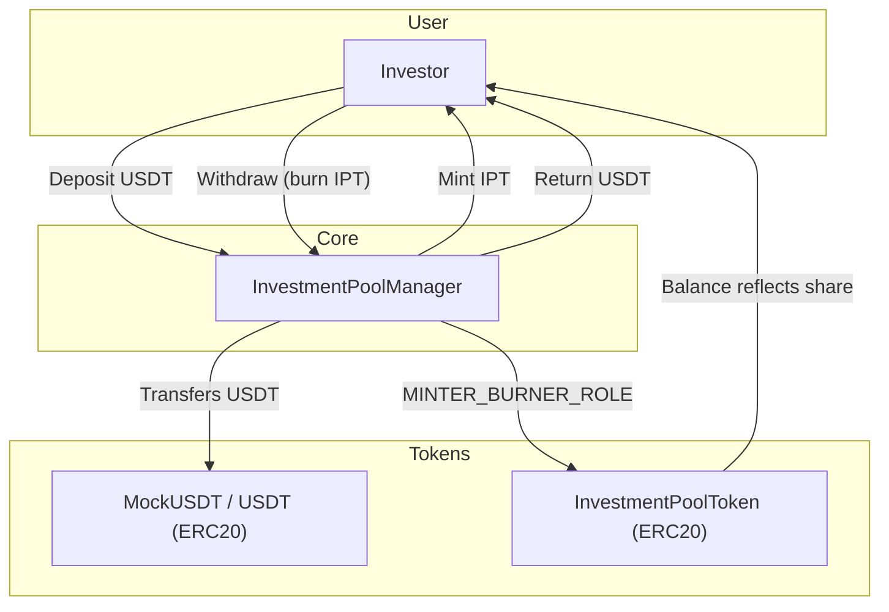

# Trade Mutual – Investment Pool Contracts

Smart-contract suite for the Trade Mutual investment pool.  
Core components:

1. **InvestmentPoolManager** – central logic (deposit, withdraw, lock-in, threshold transfer, admin/manager roles).
2. **InvestmentPoolToken (IPT)** – ERC-20 pool share token, minted/burned by the manager.
3. **MockUSDT** – mock ERC-20 funding token for local testing (replace with real USDT address in production).

## Architecture



*Deposits:* user sends USDT to the manager; manager mints IPT to the user.  
*Withdrawals:* user burns IPT; manager releases USDT after the lock-in period.  
When the pool balance exceeds a configurable threshold the manager can (auto/manual) forward funds to a multisig.

## Admin Configuration

The `DEFAULT_ADMIN_ROLE` in `InvestmentPoolManager` can manage the following settings:

| Function | Purpose |
|----------|---------|
| `setThreshold(uint256 _threshold)` | Update the USDT amount that triggers auto-transfer to multisig. |
| `setLockPeriod(uint256 _lockPeriod)` | Set the lock-in duration (in seconds) for every new deposit. |
| `setMultisig(address _multisig)` | Change the multisig wallet that receives pooled funds. |
| `setManager(address _manager)` | Grant the **MANAGER_ROLE** to a new manager (for emergency token recovery). |
| `setFundingToken(address _fundingToken)` | Update the ERC-20 used as the funding token (e.g., switch from mock to real USDT). |
| `setPoolToken(address _poolToken)` | Update the address of the pool share token (IPT). |
| `manualTransferToMultisig(uint256 amount)` | Manually move any amount (≤ pool balance) to the multisig wallet. |

`MANAGER_ROLE` holders can additionally call:

| Function | Purpose |
|----------|---------|
| `emergencyWithdrawERC20(address token, address to, uint256 amount)` | Rescue any ERC-20 tokens accidentally sent to the manager contract (except the funding token). |

> Note: Roles are based on OpenZeppelin's **AccessControl**. Admins can grant/revoke roles as needed.

---

## Forge Commands

```bash
# Compile
forge build

# Run tests
forge test

# Format code
forge fmt

# Gas snapshot
forge snapshot

# Local node
anvil

# Deploy script (example)
forge script script/DeployInvestmentPool.s.sol --rpc-url <RPC_URL> --private-key <PK> --broadcast
```


